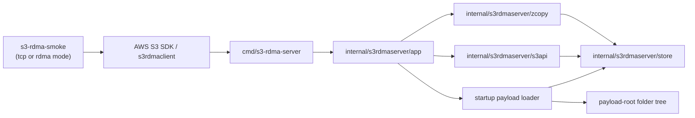
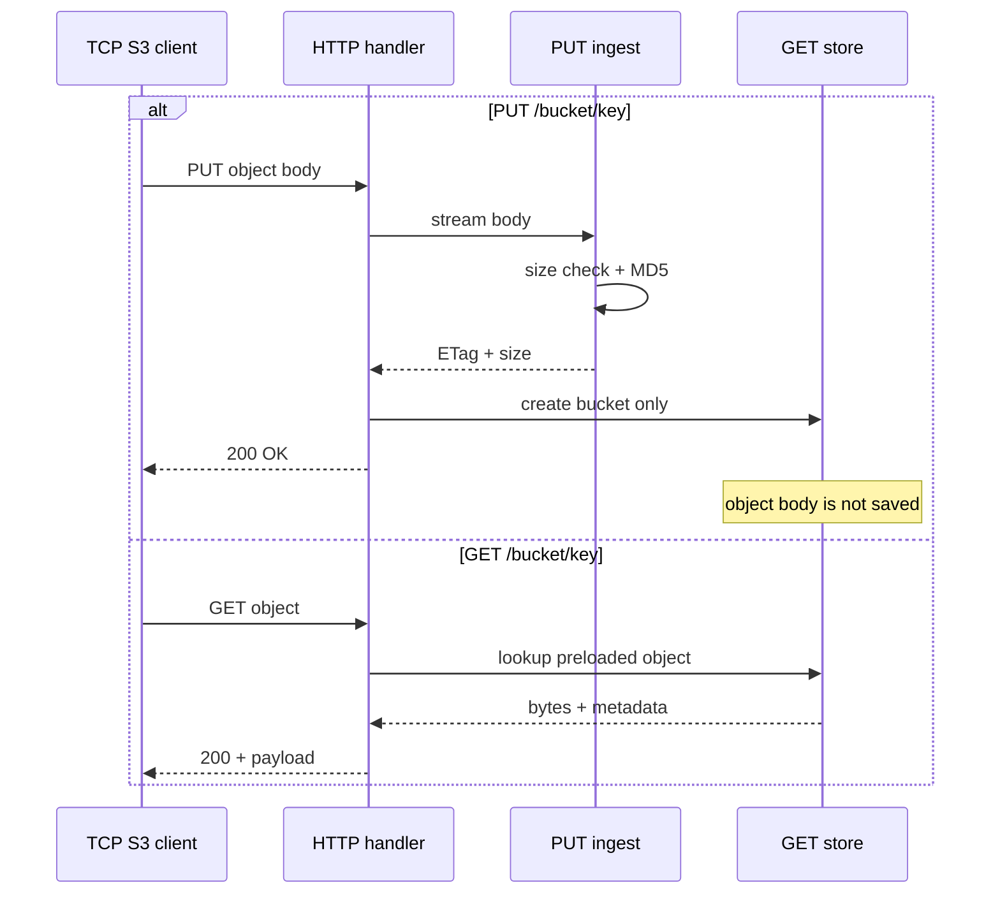
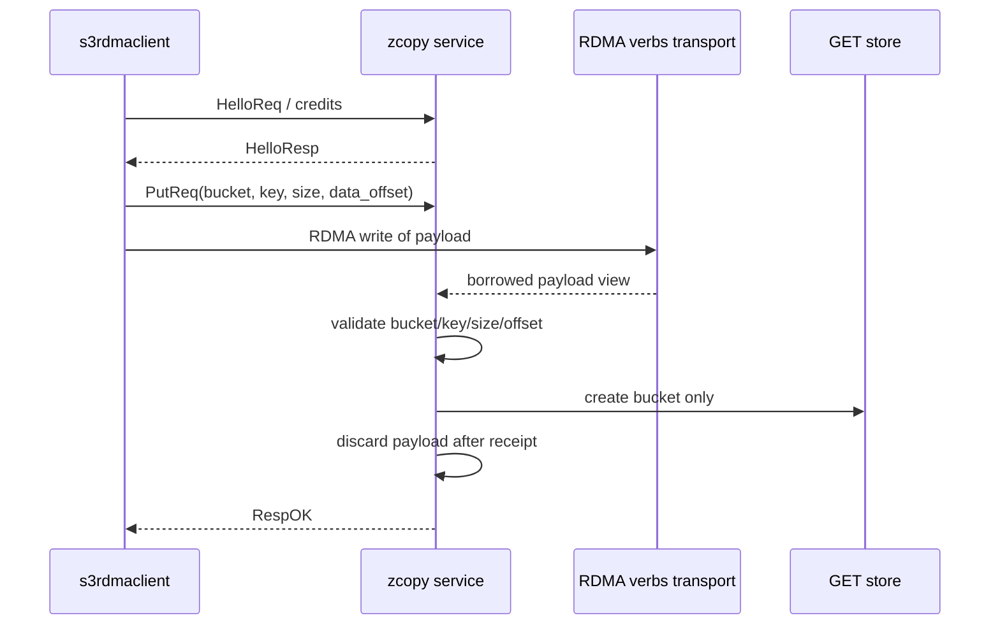
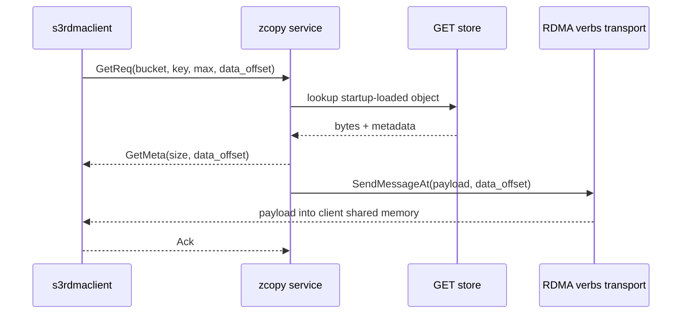
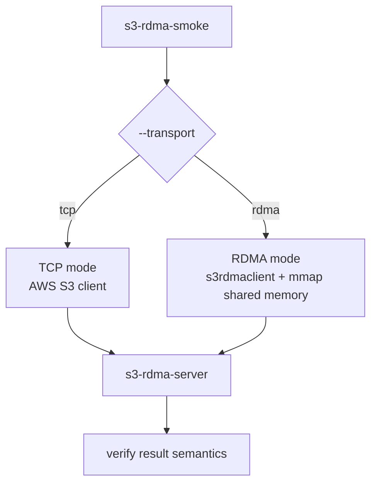
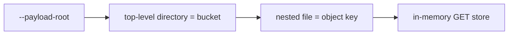

# `s3-rdma-server` Architecture

This document captures the target design for the new standalone `s3-rdma-server`.

## Design Goals

- keep the server compact and easy to move to a separate repository
- keep the TCP/S3 benchmark behavior already relied on by existing clients
- add only the RDMA zcopy path required by the modified SDK
- discard all uploaded `PUT` objects after successful receipt
- keep only startup-loaded `GET` objects in memory

## High-Level Components

## TCP PUT / GET Flow

Notes:

- TCP `PUT` never makes the uploaded object readable later.
- TCP `GET` only serves objects loaded from `--payload-root` at startup.

## RDMA PUT Flow

Notes:

- RDMA is used only for the zcopy path.
- No non-zcopy RDMA API is implemented.
- The server does not persist uploaded PUT bytes.

## RDMA GET Flow

Notes:

- RDMA GET only serves startup-loaded objects.
- `max` is enforced before the payload send.
- Credits and `Ack` continue to follow the current client protocol expectations.

## Smoke Tool Interaction

Expected smoke-tool semantics:

- `put`: upload succeeds
- `get`: preloaded object is readable and optionally verified
- `put-get`: upload succeeds, but later `GET` of that uploaded key should fail unless the key was already preloaded

## Startup Data Loading

Rules:

- loading happens once before listeners start
- empty `--payload-root` means no preloaded readable objects
- there is no runtime reload API in v1
